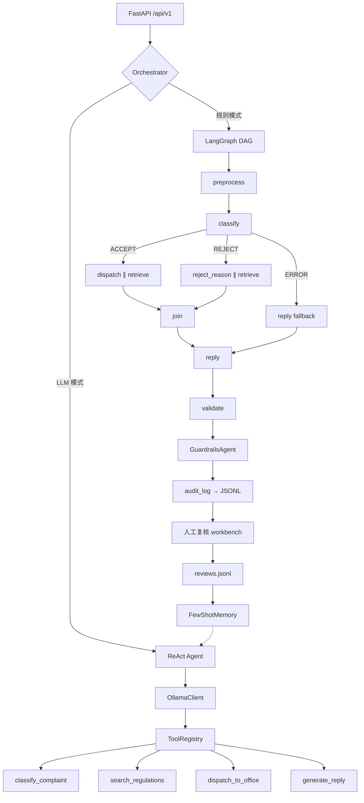

# 市场监管投诉智能处理系统

[](https://python.org)
[](https://fastapi.tiangolo.com)
[](https://langchain-ai.github.io/langgraph/)
[](LICENSE)

> 本地优先、人机协同的多智能体市场监管投诉处理系统。
> 支持规则基线 + LLM ReAct Agent 双模式，LangGraph 并行编排，内置评估框架与安全护栏。

---

## 🏗 架构



## ⚡ 快速启动

### Docker（推荐）

```bash
# 仅启动规则模式 Agent
docker compose up -d

# 含 Ollama LLM Agent（需 GPU/CPU 支持 qwen2.5:7b）
docker compose --profile llm up -d
```

接口文档：`http://localhost:8000/docs`

### 本地开发

```bash
python3.12 -m venv .venv
source .venv/bin/activate   # Windows: .venv\Scripts\Activate.ps1
pip install -e ".[dev]"
uvicorn app.main:app --reload
```

## 🧠 核心能力

| 模块 | 说明 |
|------|------|
| **双模式编排** | LangGraph DAG（规则基线）+ ReAct Agent（LLM tool-calling）|
| **并行 Agent 执行** | 受理路径下 dispatch 与 retrieve 并行 fan-out，降低延迟 |
| **5 个专家 Agent** | Classifier / RejectReason / Dispatch / Retrieval / Reply |
| **RAG 混合检索** | ChromaDB 向量 → 关键词规则降级，Chroma 不可用时自动回退 |
| **人机协同** | 低置信度(<0.72)、敏感词、降级场景 → 人工复核工作台 |
| **全链路追踪** | 每步 Agent 耗时/置信度/错误 → JSONL + `/metrics` Prometheus |
| **安全护栏** | GuardrailsAgent：输入 PII 检测 + 输出法规引用合规校验 |
| **Agent 记忆** | ConversationMemory（短期窗口）+ FewShotMemory（历史案例检索）|
| **评估框架** | 15 条标注 golden dataset，分类/分派/检索/端到端自动化评估 |

## 📡 接口

| 方法 | 端点 | 说明 |
|------|------|------|
| `POST` | `/api/v1/complaints/analyze` | 规则模式分析（LangGraph DAG）|
| `POST` | `/api/v1/complaints/analyze-llm` | LLM ReAct Agent 分析 |
| `POST` | `/api/v1/complaints/analyze-llm/stream` | LLM Agent SSE 流式输出 |
| `POST` | `/api/v1/reviews/{trace_id}/confirm` | 人工复核确认 |
| `GET` | `/api/v1/traces/{trace_id}` | 全链路执行追踪 |
| `GET` | `/api/v1/reviews/stats` | 复核统计 |
| `GET` | `/api/v1/system/status` | 系统运行状态 |
| `GET` | `/metrics` | Prometheus 指标 |
| `POST` | `/api/v1/reviews/export-training` | 导出复核训练数据 |
| `POST` | `/api/v1/rag/reject-reply` | RAG 法规检索 + 退回回复 |
| `GET` | `/api/v1/rag/laws` | 法规文档列表 |

## 🧪 评估

```bash
# 快速抽查（5条样本）
python -m eval.run_evaluation --quick

# 完整评估 + 导出结果
python -m eval.run_evaluation --output eval/results.json
```

评估维度：分类准确率 / 分派正确率 / 检索命中率 / 端到端准确率 / 延迟 p50 p95

## 🛡 安全

- **输入护栏**：PII 检测（手机号/身份证/银行卡）+ 无效输入过滤
- **输出护栏**：敏感措辞检测 + 法规条文引用校验
- **降级策略**：LLM 不可用时自动回退规则引擎，不中断服务

## 📁 目录

```
app/
├── agents/          # 7 个 Agent（含 Guardrails + Memory）
├── api/routes.py    # 15 个 REST 端点
├── core/            # 配置/模型/日志/指标/Prompt 加载
├── tools/           # 训练/评估/数据导入/规则挖掘
├── static/          # 人工复核工作台 (HTML)
eval/                # 评估框架 + golden dataset
prompts/             # Prompt 模板（5 个）
data/                # 运行时数据（dispatch/knowledge/chroma）
models/              # 训练好的 ML 模型
```

## ⚙ 配置

通过 `app/core/config.py` 的 `Settings` 类，所有选项支持环境变量覆盖：

| 变量 | 默认值 | 说明 |
|------|--------|------|
| `ORCHESTRATOR_BACKEND` | `langgraph` | 编排器（langgraph / simple）|
| `OLLAMA_BASE_URL` | `http://localhost:11434/v1` | LLM 服务地址 |
| `OLLAMA_MODEL` | `qwen2.5:7b` | LLM 模型名 |
| `ACCEPT_TRAINING_CSV` | `data/training/...` | 训练数据路径 |
| `ACCEPT_MODEL_DIR` | `models/accept_v4` | 模型保存目录 |
| `USE_CHROMA_RETRIEVAL` | `true` | 启用向量检索 |
| `EMBEDDING_PROVIDER` | `hash` | 嵌入方案（hash / bge）|

## 📝 训练模型

```bash
# 稳定模型: TF-IDF + LogisticRegression（推荐）
python -m app.tools.train_accept_model

# 实验模型: BERT
python -m app.tools.train_accept_bert --epochs 3 --batch-size 8
```

## 📄 License

MIT
