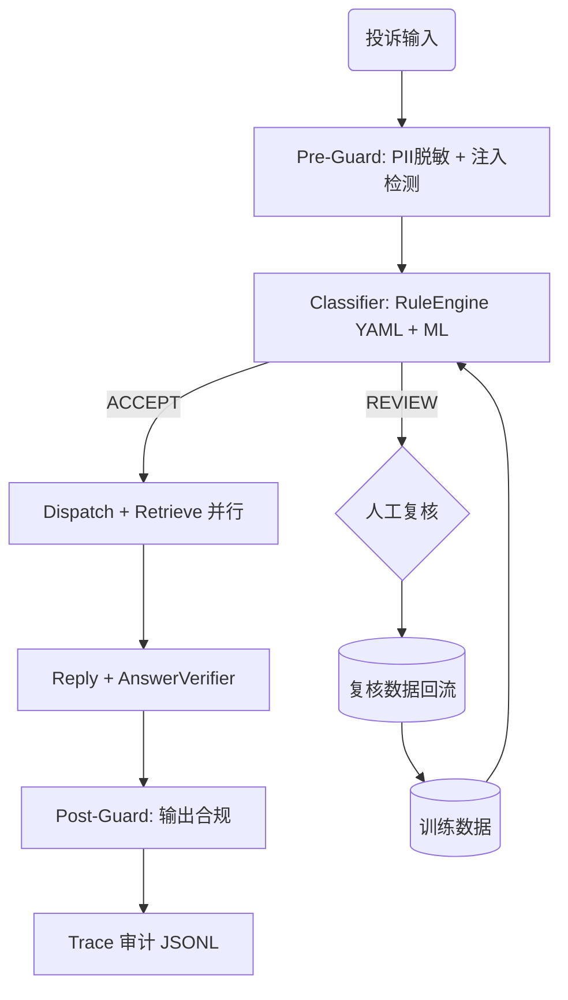

# 市场监管投诉智能处理系统

[](https://python.org)
[](https://fastapi.tiangolo.com)
[](https://langchain-ai.github.io/langgraph/)
[](LICENSE)

> 本地优先、人机协同的多智能体市场监管投诉处理系统。
> 规则引擎（YAML 配置化）+ 轻量 ML + ChromaDB RAG + 注入检测 + 答案校验 + 人工复核闭环。

---

## 架构



## 快速启动

### Docker（推荐）

```bash
docker compose up -d                  # 规则模式
docker compose --profile llm up -d    # 含 Ollama LLM
```

接口文档：`http://localhost:8000/docs`

### 本地开发

```bash
python3.12 -m venv .venv
source .venv/bin/activate
pip install -e ".[dev]"
uvicorn app.main:app --reload
```

## 核心能力

| 模块 | 说明 |
|------|------|
| **规则引擎配置化** | YAML 规则文件（accept/reject/dispatch/sensitive），RuleLoader + RuleEngine 替代硬编码关键词 |
| **双模式编排** | LangGraph DAG（规则基线）+ ReAct Agent（LLM tool-calling）|
| **并行 Agent 执行** | 受理路径下 dispatch 与 retrieve 并行 fan-out，降低延迟 |
| **6 个专家 Agent** | Classifier / RejectReason / Dispatch / Retrieval / Reply / Guardrails |
| **RAG 可信度** | RAG 评估集 50 条 + 评估器（Recall@K/MRR）+ AnswerVerifier 法规引用真实性校验 |
| **注入检测** | PromptInjectionDetector：6 类注入攻击检测（指令覆盖/角色劫持/提示词窃取/强制受理/跳过法规/代码注入）|
| **人机协同闭环** | 复核队列 API（pending/detail/reject/confirm）+ 训练数据冲突检测（label/decision/model 三类）|
| **全链路追踪** | AgentStep.decision_source + SSE 节点进度事件 + JSONL + `/metrics` Prometheus |
| **安全护栏** | GuardrailsAgent：输入 PII + 注入检测 + 输出过度承诺拦截 + 法规引用校验 |
| **评估框架** | Golden Dataset 100 条（6 类覆盖）+ 误拒率/复核率/回复合规率指标 |

## 接口

| 方法 | 端点 | 说明 |
|------|------|------|
| `POST` | `/api/v1/complaints/analyze` | 规则模式分析 |
| `POST` | `/api/v1/complaints/analyze-llm` | LLM ReAct Agent 分析 |
| `POST` | `/api/v1/complaints/analyze-llm/stream` | LLM Agent SSE 流式 |
| `POST` | `/api/v1/complaints/debate` | 双 Agent 交叉验证 |
| `GET` | `/api/v1/reviews/pending` | 待复核列表 |
| `GET` | `/api/v1/reviews/{trace_id}` | 复核详情 |
| `POST` | `/api/v1/reviews/{trace_id}/confirm` | 复核确认 |
| `POST` | `/api/v1/reviews/{trace_id}/reject` | 驳回复核 |
| `GET` | `/api/v1/reviews/stats` | 复核统计 |
| `GET` | `/api/v1/traces/{trace_id}` | 全链路追踪 |
| `GET` | `/health` `/readyz` | 健康检查 |
| `GET` | `/metrics` | Prometheus 指标 |
| `POST` | `/api/v1/reviews/export-training` | 导出训练数据 |

## 评估

```bash
# 快速抽查
python -m eval.run_evaluation --quick

# 完整评估 + 导出
python -m eval.run_evaluation --output eval/results.json

# RAG 专项评估
python -m eval.run_rag_eval
```

评估维度：分类准确率 / 分派正确率 / RAG 召回率 / 端到端 / 误拒率 / 复核率 / 回复合规率 / 延迟 p50 p95

## 安全

- **Pre-Guard**：PII 脱敏 + 注入攻击检测（6 类 32 个测试用例）
- **Post-Guard**：过度承诺拦截 + 法规引用校验 + 绝对化措辞检测
- **Rate Limit**：IP 滑动窗口限流（30 req/min），`/health` `/readyz` `/metrics` 白名单豁免
- **降级策略**：LLM 不可用 → 规则引擎；ChromaDB 不可用 → 关键词匹配

## 目录

```
app/
├── agents/          # Agent（含 RuleEngine/AnswerVerifier/PromptInjection）
├── api/routes.py    # REST 端点（含复核队列 API）
├── core/            # 配置/模型/日志/指标/RuleLoader/RateLimit
├── tools/           # 训练/评估/冲突检测/数据导入
├── static/          # 人工复核工作台 (HTML)
eval/                # 评估框架 + golden dataset 100 条 + RAG 评估器
data/
├── rules/           # YAML 规则文件（accept/reject/dispatch/sensitive）
├── security/        # 注入检测测试用例
├── dispatch/        # 分派规则映射表
├── knowledge/       # RAG 法规知识库
├── samples/         # 脱敏后的投诉工单示例（真实工单数据不公开）
tests/               # 202 个测试用例
```

## 数据与隐私合规

本项目基于**真实 12315 投诉工单**开发（青铜峡市市场监管局见习期间，抽样 200 条分析数据分布后设计分层调度架构），但：

- **真实工单数据不随仓库分发**：含个人信息（投诉人地址、消费记录、联系方式等）的原始工单、训练集、向量库已从本仓库及其 **git 全部历史** 中清除，本地保留于私有备份。
- `data/samples/complaint_samples.csv` 提供 10 条**脱敏示例**（保留真实工单的结构与表达习惯，姓名/电话/地址/店铺已替换为占位符），供复现数据形态与流程演示。
- 系统内置的 PII 脱敏（Pre-Guard）在运行时对输入投诉同样生效。
- 如需使用真实数据，请通过合法渠道获取并自行完成脱敏后接入。

## 配置

| 变量 | 默认值 | 说明 |
|------|--------|------|
| `ORCHESTRATOR_BACKEND` | `langgraph` | 编排器（langgraph / simple）|
| `OLLAMA_BASE_URL` | `http://localhost:11434/v1` | LLM 服务地址 |
| `OLLAMA_MODEL` | `qwen2.5:7b` | LLM 模型名 |
| `USE_CHROMA_RETRIEVAL` | `true` | 启用向量检索 |
| `EMBEDDING_PROVIDER` | `hash` | 嵌入方案（hash / bge）|

## License

MIT
