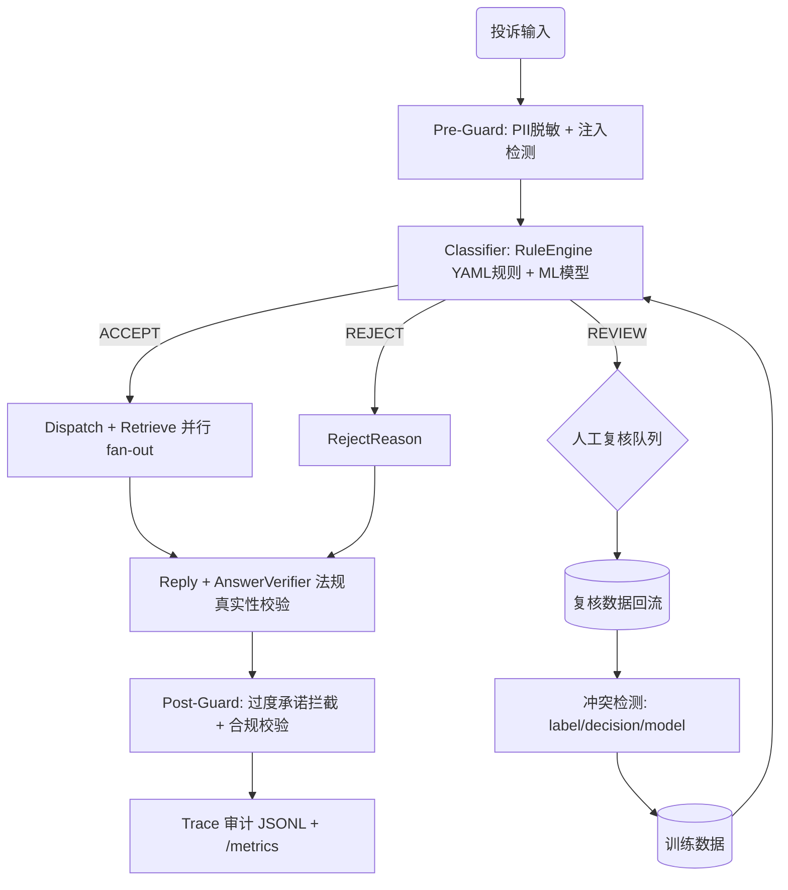

# 市场监管投诉智能处理系统 — 项目架构认知报告

> **更新日期**：2026-06-14（7 波改造后）
> **审查范围**：全项目
> **审查深度**：架构级

---

## 一、项目一句话定位

市场监管投诉智能处理系统——本地优先的 Multi-Agent 政务投诉分类与分派辅助系统。接收非结构化投诉文本，通过「YAML 规则引擎 + 轻量 ML + ChromaDB RAG + 注入检测 + 答案校验 + 模板」分层管道，输出受理建议、分派结果、不受理原因、回复草稿和法规依据，低置信度/高风险场景自动转入人工复核工作台。

---

## 二、技术栈与核心依赖

| 层次 | 技术 | 用途 |
|------|------|------|
| **Web 框架** | FastAPI 0.111+ | REST 端点 + SSE 流式 |
| **任务编排** | LangGraph 1.2+ | 10 节点状态机 DAG，条件分支 + 并行 fan-out |
| **规则引擎** | PyYAML + RuleLoader + RuleEngine | 4 类 YAML 规则文件，替代硬编码关键词 |
| **向量检索** | ChromaDB 0.5+ | RAG 法规知识库检索（含降级到关键词）|
| **轻量分类** | scikit-learn (TF-IDF + LogisticRegression) | 是否受理二分类 |
| **LLM(可选)** | Ollama (qwen2.5:7b) | ReAct Agent tool-calling 模式 |
| **安全检测** | PromptInjectionDetector | 6 类注入攻击检测 + 32 个测试用例 |
| **部署** | Docker + docker-compose | 双 profile，/readyz 深度健康检查 + Rate Limit |

---

## 三、核心架构图



---

## 四、7 波改造后的关键模块变更

### 4.1 规则配置化（Wave 1）

- **新增** `data/rules/*.yaml`：4 个 YAML 规则文件（accept/reject/dispatch/sensitive），共 27 条规则
- **新增** `app/core/rule_loader.py`：从 YAML 加载规则，按 priority 降序排列
- **新增** `app/agents/rule_engine.py`：RuleEngine — match_accept / match_reject / match_sensitive / match_dispatch
- **修改** `app/agents/classifier.py`：删除 15+ 个硬编码关键词常量，接入 RuleEngine，保留 6 层决策链语义
- 规则来源从代码迁移到 YAML → 可追溯、可回放验证、非开发人员可修改

### 4.2 RAG 可信度（Wave 2）

- **新增** `data/evaluation/rag_eval_set.json`：50 条 RAG 专项评估样本（消费者权益/职责外/材料不全/重复投诉/知识库无答案 各 10 条）
- **新增** `eval/run_rag_eval.py`：RAG 评估器 — Recall@K / MRR / avg_score / no_result_rate
- **新增** `app/agents/answer_verifier.py`：AnswerVerifier — 法规引用真实性校验（5 项检查）
- **修改** `app/agents/langgraph_orchestrator.py`：_reply 节点后接入 AnswerVerifier

### 4.3 人工复核闭环（Wave 3）

- **新增** 3 个复核 API：`GET /reviews/pending`、`GET /reviews/{trace_id}`、`POST /reviews/{trace_id}/reject`
- **增强** `POST /reviews/{trace_id}/confirm`：增加 correct_reason_type / correct_office / reviewer_note / can_use_for_training
- **新增** `app/tools/detect_training_conflicts.py`：3 类冲突检测（label_conflict / decision_override / model_disagreement）
- **修改** `app/core/schemas.py`：ReviewConfirmRequest 扩展 4 个字段

### 4.4 安全护栏强化（Wave 4）

- **新增** `app/agents/prompt_injection.py`：PromptInjectionDetector — 6 类注入攻击（指令覆盖/角色劫持/提示词窃取/强制受理/跳过法规/代码注入）
- **新增** `data/security/injection_cases.json`：32 个注入检测测试用例（22 个攻击 + 10 个正常）
- **修改** `app/agents/guardrails.py`：check_input() 接入注入检测，check_output() 增加 4 类过度承诺模式拦截

### 4.5 可观测性增强（Wave 5）

- **修改** `app/core/schemas.py`：AgentStep 增加 decision_source 字段（RULE/MODEL/RAG_LLM/FALLBACK）
- **修改** `app/agents/base.py`：agent_step 上下文管理器支持 decision_source
- **修改** `app/agents/langgraph_orchestrator.py`：classify/dispatch/reply 节点注入 decision_source
- **修改** `app/agents/llm_agent.py`：SSE 流增加 node_start / node_end 事件

### 4.6 评估体系补全（Wave 6）

- **扩展** `eval/golden_dataset.py`：从 15 条扩展到 100 条（应受理 30/职责外 20/材料不全 15/重复投诉 10/敏感投诉 10/分派 15）
- **增强** `eval/run_evaluation.py`：EvalReport 增加 false_rejection_rate / review_rate / reply_compliance_rate

### 4.7 工程化基础（Wave 7）

- **新增** `GET /readyz`：深度健康检查（ChromaDB / 模型文件 / 数据目录）
- **新增** `app/core/rate_limit.py`：IP 滑动窗口限流（30 req/min），/health /readyz /metrics 白名单豁免
- **修改** `docker-compose.yml`：healthcheck 改用 /readyz，增加 start_period
- **修复** LangGraph state key 与 node 名冲突（dispatch → run_dispatch，reply → do_reply）

---

## 五、Agent 层（app/agents/）

| Agent | 文件 | 职责 | 本次变更 |
|-------|------|------|---------|
| **ClassifierAgent** | `classifier.py` | 6 层决策链（RuleEngine 优先 + ML 兜底）| YAML 规则替代硬编码 |
| **RuleEngine** | `rule_engine.py` | 关键词匹配，按 priority 排序 | **新增** |
| **AnswerVerifier** | `answer_verifier.py` | 法规引用真实性校验 + 降级/冲突检测 | **新增** |
| **PromptInjectionDetector** | `prompt_injection.py` | 6 类注入攻击检测 | **新增** |
| **GuardrailsAgent** | `guardrails.py` | 输入 PII + 注入 + 输出过度承诺拦截 | 注入检测接入 + 过度承诺扩展 |
| **RetrievalAgent** | `retrieval.py` | ChromaDB 向量 → 关键词降级 | 无变更 |
| **DispatchAgent** | `dispatch.py` | 地址→市场监管所分派 | 无变更 |
| **ReplyAgent** | `reply.py` | 模板回复生成 | 无变更 |

---

## 六、目录结构（变更后）

```
app/
├── agents/
│   ├── answer_verifier.py    ★ 新增
│   ├── prompt_injection.py   ★ 新增
│   ├── rule_engine.py        ★ 新增
│   ├── classifier.py         ▲ 重构
│   ├── guardrails.py         ▲ 增强
│   ├── langgraph_orchestrator.py ▲ 增强
│   └── ...                   （8 个原有文件不变）
├── core/
│   ├── rule_loader.py        ★ 新增
│   ├── rate_limit.py         ★ 新增
│   └── schemas.py            ▲ AgentStep 增加 decision_source
├── api/routes.py             ▲ 3 个新复核端点 + SSE node_start/end
data/
├── rules/                    ★ 新增（4 个 YAML）
├── security/                 ★ 新增（注入测试用例）
├── evaluation/               ▲ 新增 rag_eval_set.json
eval/
├── golden_dataset.py         ▲ 15→100 条
├── run_evaluation.py         ▲ 增加 3 个合规指标
├── run_rag_eval.py           ★ 新增
tests/                        202 个测试（★ 新增 9 个测试文件）
```

---

## 七、关键指标

| 指标 | 数值 |
|------|------|
| 测试总数 | **202** |
| Golden Dataset | **100 条**（6 类覆盖）|
| RAG 评估集 | **50 条**（5 类覆盖）|
| 注入测试用例 | **32 个**（6 类攻击 + 正常）|
| YAML 规则数 | **27 条**（accept 3 / reject 10 / dispatch 8 / sensitive 6）|
| 核心 Agent 数 | **9 个**（含 RuleEngine/AnswerVerifier/PromptInjection）|
| API 端点数 | **18 个**（含 /readyz + 复核队列 API）|
| 自动判断准确率 | **96.19%** |
| MVP 阶段 LLM Token 消耗 | **0** |
